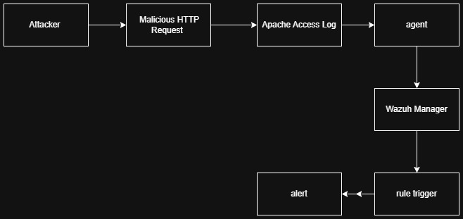
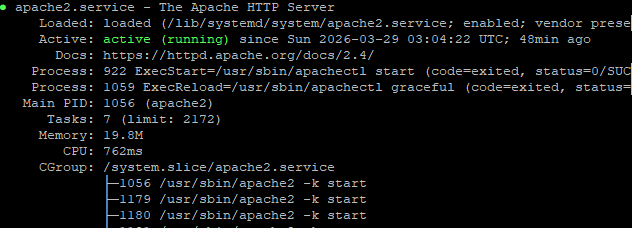
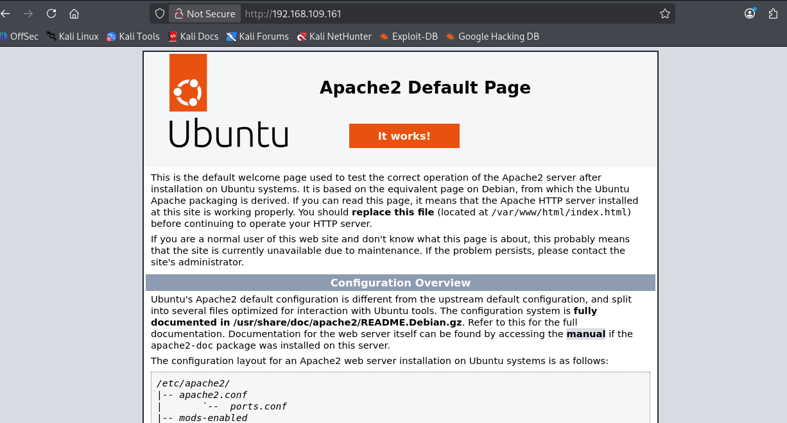
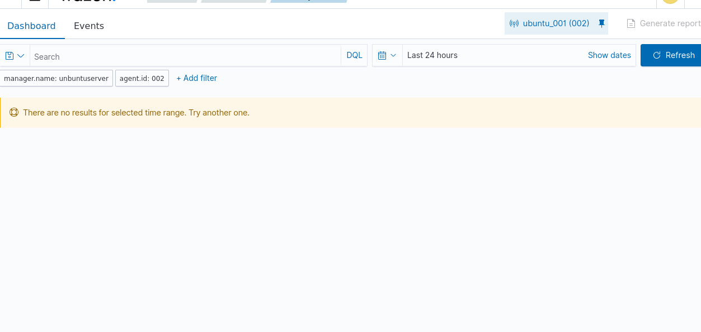
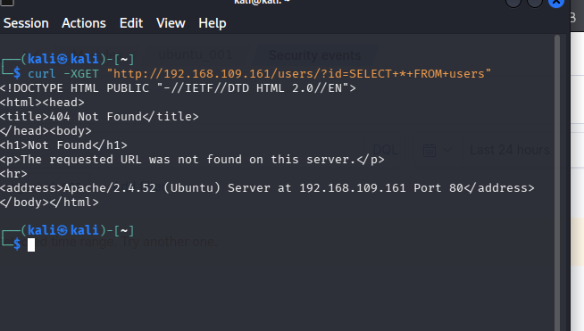
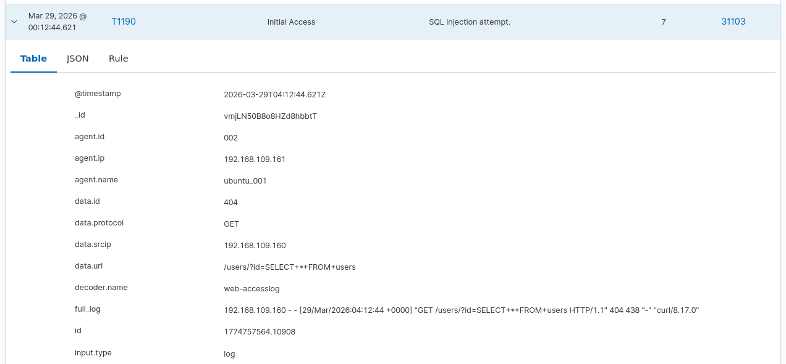
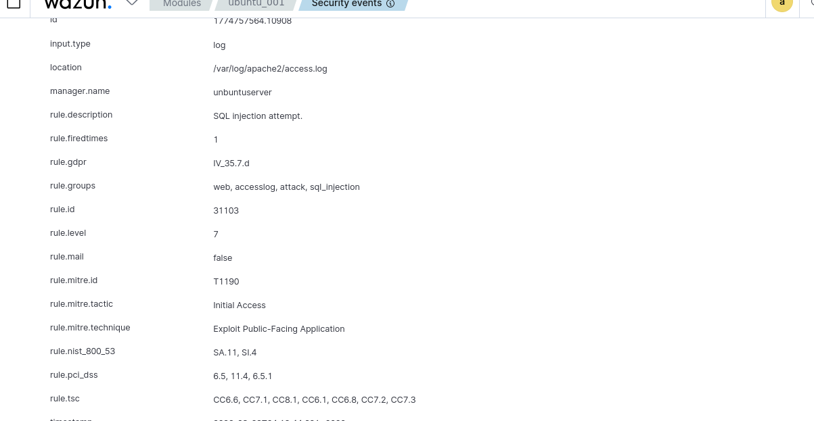

# Web Attack Detection Lab: SQL Injection Detection with Wazuh

## 1 Scenario Description

### SQL Injection Detection (MITRE ATT&CK T1190)

SQL Injection is one of the most common web application attacks where an attacker attempts to manipulate backend database queries by injecting malicious SQL statements into input fields such as login forms or URL parameters.

In this scenario, an attacker attempts to perform a SQL Injection attack against an Apache web server by sending specially crafted HTTP requests containing SQL payloads such as:

```
' OR 1=1 --
UNION SELECT
SELECT * FROM users
```

These malicious requests are recorded in the Apache access logs. The Wazuh agent monitors these logs and forwards them to the Wazuh manager for analysis.

Wazuh built-in web attack detection rules analyze the HTTP requests and identify SQL injection patterns. When suspicious payloads are detected, Wazuh generates a security alert indicating a possible web attack attempt.

This scenario demonstrates how Wazuh can detect web application attacks by analyzing web server logs and providing real-time visibility into potential threats.

Workflow:



## 2 Configuration

🛡️ Scenario: SQL Injection Detection using Wazuh and Apache Logs

This section describes the steps required to configure the Ubuntu endpoint and Wazuh agent to monitor Apache web logs and detect SQL injection attacks.


### 1 Install Apache Web Server

Update system packages and install Apache:

```bash
sudo apt update
sudo apt install apache2 -y
```

Verify Apache service is running:

```
sudo systemctl status apache2
```



Test the web server:



### 2 Configure Firewall (Optional)

If UFW firewall is enabled, allow HTTP traffic:

```bash
sudo ufw app list
sudo ufw allow 'Apache'
sudo ufw status
```

### 3 Configure Wazuh Agent to Monitor Apache Logs

Edit the Wazuh agent configuration file:

```bash
sudo nano /var/ossec/etc/ossec.conf
```

Add the following configuration inside ```<ossec_config>```:

```xml
<localfile>
  <log_format>apache</log_format>
  <location>/var/log/apache2/access.log</location>
</localfile>
```

### 4 Restart Wazuh Agent

Apply the configuration:

```bash
sudo systemctl restart wazuh-agent
```

## 3 Attack Simulation & Verification

After completing the configuration of the Ubuntu endpoint and Wazuh manager, we simulate a SQL Injection attack to verify that Wazuh can successfully detect malicious web requests.

### Attack Emulation

From the attacker machine, execute the following command to simulate a SQL Injection attempt:

```bash
curl -XGET "http://<UBUNTU_IP>/users/?id=SELECT+*+FROM+users"
```

This request attempts to inject an SQL query into the web application's URL parameter. The malicious request is recorded in the Apache access log and forwarded to Wazuh for analysis.

Wazuh analyzes the HTTP request using its built-in web attack detection rules and generates alerts when SQL injection patterns are detected.

### Verification

The following screenshots show the detection process:



At this stage, no suspicious activity has been generated and the Wazuh dashboard shows no security alerts



The attacker sends a malicious HTTP request containing SQL payload.



Wazuh detects suspicious SQL patterns and triggers the alert ```(Rule 31103)``` (1).



Wazuh detects suspicious SQL patterns and triggers the alert ```(Rule 31103)``` (2).

## 4 Conclusion

This lab demonstrates how Wazuh can effectively detect SQL Injection attacks by monitoring Apache web server logs and applying built-in web attack detection rules.

During the attack simulation, the attacker sent a crafted HTTP request containing an SQL query payload. The Apache server recorded this request in the access logs, which were then collected and analyzed by the Wazuh agent. Wazuh successfully identified the malicious SQL patterns and generated security alerts (Rule 31103), proving that the detection pipeline is working as expected.

This experiment highlights the importance of centralized log monitoring and automated threat detection for protecting web applications against common attacks such as SQL injection. By leveraging Wazuh SIEM capabilities, security teams can quickly identify suspicious web activity and respond to potential threats in real time.

Overall, this scenario demonstrates a practical approach to detecting web attacks using log analysis and can be extended to detect other web-based threats such as Cross-Site Scripting (XSS), command injection, and directory traversal attacks.

## References

https://owasp.org/www-community/attacks/SQL_Injection

https://documentation.wazuh.com/current/proof-of-concept-guide/detect-web-attack-sql-injection.html
